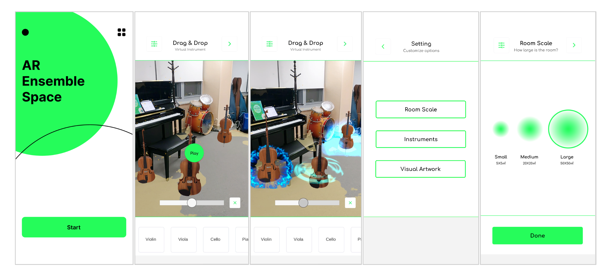

# AR Ensemble Space

'AR Ensemble Space' is an augmented reality spatial music visualizer system.

### Introduction

This is a final project in 'Augmented Reality (CTP445, 2022 Spring)' by Prof. Sangho Yoon of KAIST. ([Course Website](https://hcitech.org/course/CTP445_Spring2022.html))

- Demo: https://youtu.be/1u8Jn2Bu8Yg

'AR Ensemble Space' is an augmented reality (AR) music visualization system that creates visual effects based on music information and applies spatial (3D) sound. It aims to enrich the music ensemble experience for audiences and musicians in personal space and bridge the gap between virtual and real concerts. Additionally, a musician or conductor who finds it difficult to simulate multiple instruments before rehearsal can also simulate on the given stage with augmented reality objects in our system.

### Supported versions & Device
- Unity v2021.3 or higher
- FMOD v2.02
- Android OS 7.0 or higher

### References
- Huang, F., Zhou, Y., Yu, Y., Wang, Z., & Du, S. (2011, August). Piano ar: A markerless augmented reality based piano teaching system. In 2011 Third international conference on intelligent human-machine systems and cybernetics (Vol. 2, pp. 47-52). IEEE.
- Reddy, G. R., & Rompapas, D. (2021, June). Liquid Hands: Evoking Emotional States via Augmented Reality Music Visualizations. In ACM International Conference on Interactive Media Experiences (pp. 305-310).
- Trujano, F., Khan, M., & Maes, P. (2018, August). ARPiano efficient music learning using augmented reality. In International Conference on Innovative Technologies and Learning (pp. 3-17). Springer, Cham.
